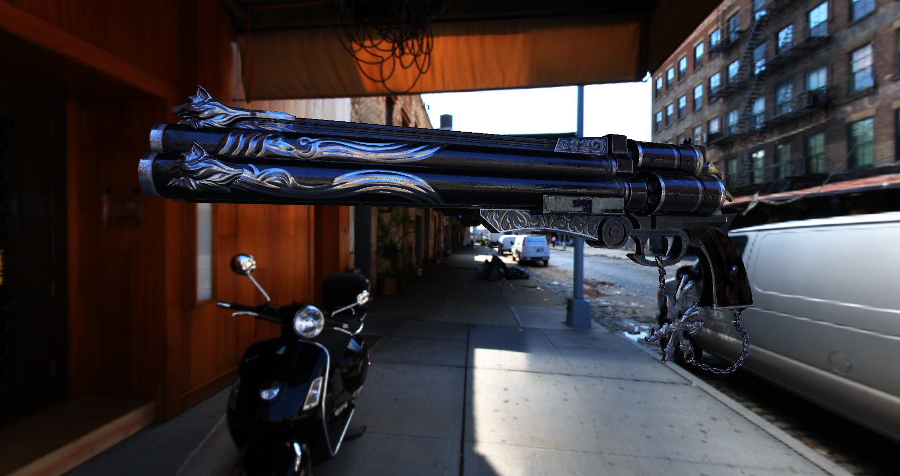
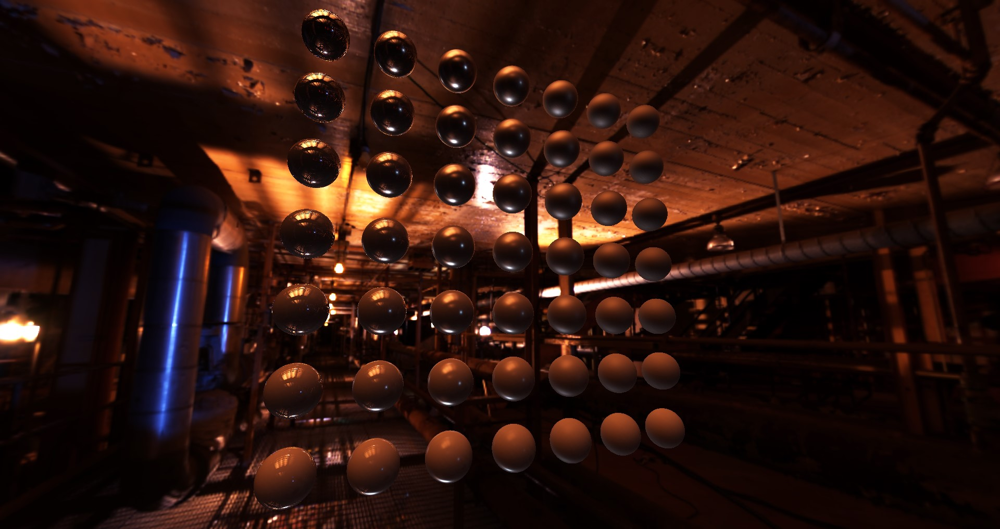
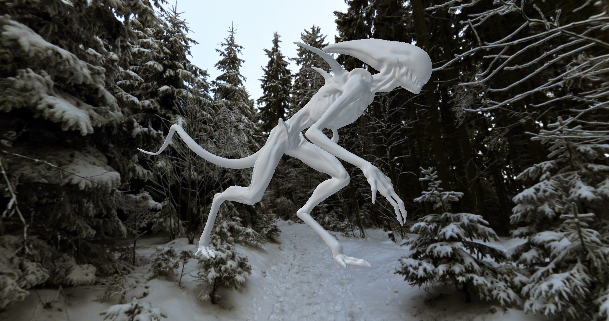
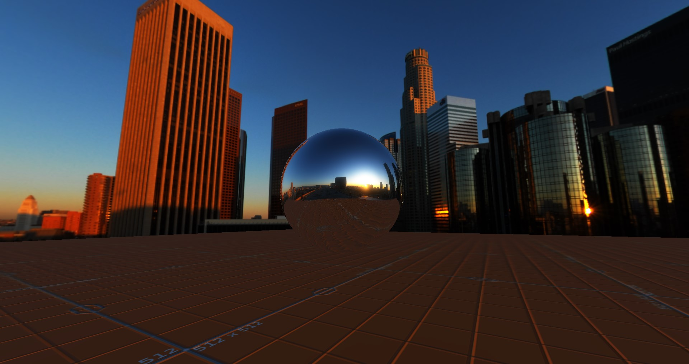

# Eye Spark

My 15 y/o attempt at following **[the Learn OpenGL course](https://learnopengl.com/)**.

## Features

- Basic deferred metallic PBR renderer.
- Custom STL containers and standard types.
- Custom `.msh` binary mesh format.

## Screenshots

## License

Code is licensed under the MIT License.
Cerberus PBR 3D model and associated textures are courtesy of Andrew Maximov.
See the **[LICENSE](LICENSE)** file for details.
